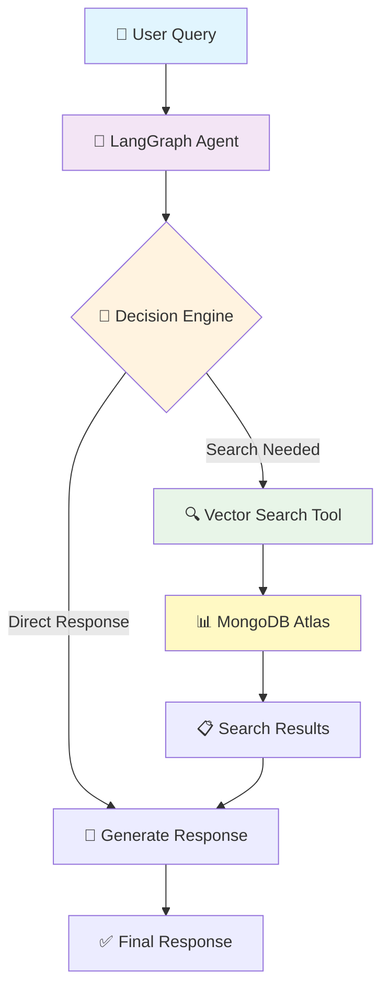

# 🛒 E-commerce AI Agent with LangGraph.js & MongoDB

<div align="center">


**Build an intelligent shopping assistant that thinks, acts, and adapts like a human sales associate**

</div>

## 🎯 What We're Building

In this tutorial, we'll create a sophisticated **AI Agent** using an **agentic approach** - not just a chatbot that responds, but an intelligent system that autonomously:

- 🧠 **Thinks**: Analyzes customer queries and decides the best action
- 🔍 **Acts**: Searches real product databases using vector embeddings  
- 🔄 **Adapts**: Falls back to alternative search strategies when needed
- 💭 **Remembers**: Maintains conversation context across interactions

---

## 📚 What You'll Learn

<table>
<tr>
<td width="50%">

### 🏗️ **Core Concepts**
- ✨ **Agentic AI Architecture**
- 🗃️ **MongoDB Atlas Vector Search**
- 🌊 **LangGraph Workflow Orchestration**
- 💬 **Conversational State Management**

</td>
<td width="50%">

### 🛠️ **Practical Skills**
- 🔗 **API Integration** (OpenAI & Gemini)
- ⚛️ **React Frontend Development**
- 🌐 **RESTful API Design**
- 📊 **Database Seeding & Management**

</td>
</tr>
</table>

---

## 🚀 Prerequisites

Before we start, make sure you have:

<table>
<tr>
<td>

**📦 Required Software**
- [Node.js & npm](https://nodejs.org/) (v18+)
- Git

</td>
<td>

**🔑 API Keys Needed**
- [Google AI API Key](https://aistudio.google.com/app/apikey)
- [MongoDB Atlas Account](https://www.mongodb.com/cloud/atlas)

</td>
</tr>
</table>

---

## ⚡ Quick Start

### 📥 **Step 1: Clone & Install**

```bash
# Clone the repository
git clone https://github.com/kubowania/ecommerce-chat-helper
cd ecommerce-chat-helper

# Install server dependencies
cd server
npm install
```

### 🔧 **Step 2: Environment Setup**

Create a `.env` file in the `server` directory:

```env
# 🤖 AI Model APIs
GOOGLE_API_KEY=your_google_api_key_here

# 🗄️ Database
MONGODB_ATLAS_URI=your_mongodb_atlas_uri_here
```

### 🌱 **Step 3: Seed the Database**

```bash
# Generate AI-powered synthetic furniture data
npm run seed
```

<details>
<summary>🔍 What happens during seeding?</summary>

- 🤖 **AI generates** 10 realistic furniture items
- 📝 **Creates searchable summaries** for each item
- 🔢 **Generates vector embeddings** using OpenAI
- 💾 **Stores everything** in MongoDB Atlas

</details>

### 🚀 **Step 4: Start the Backend**

```bash
npm run dev
```

Your AI agent is now running on `http://localhost:8000` 🎉

---

## 🧪 Testing Your AI Agent

### 💬 **Start a New Conversation**
```bash
curl -X POST -H "Content-Type: application/json" \
  -d '{"message": "Do you have any dining tables?"}' \
  http://localhost:8000/chat
```

**Response:**
```json
{
  "threadId": "1703123456789",
  "response": "Yes! I found several dining tables in our inventory. Here's what we have available..."
}
```

### 🔄 **Continue the Conversation**
```bash
curl -X POST -H "Content-Type: application/json" \
  -d '{"message": "What about the price range?"}' \
  http://localhost:8000/chat/1703123456789
```

---

## 🎨 Frontend Setup

### 📱 **Step 5: Launch the React App**

```bash
# In a new terminal, navigate to client directory
cd ../client
npm install

# Start the React development server
npm run start
```

Visit `http://localhost:3000` to see your beautiful e-commerce store with integrated AI chat! ✨

---

## 🏗️ Architecture Overview

<div align="center">



</div>

---

## 🌟 Key Features

<table>
<tr>
<td width="33%">

### 🧠 **Intelligent Decision Making**
- Autonomous tool selection
- Context-aware responses
- Multi-step reasoning

</td>
<td width="33%">

### 🔍 **Advanced Search**
- Vector semantic search
- Text fallback search
- Real-time inventory lookup

</td>
<td width="33%">

### 💬 **Natural Conversations**
- Conversation memory
- Thread-based persistence
- Human-like interactions

</td>
</tr>
</table>

---

## 🛠️ API Endpoints

| Method | Endpoint | Description | Example |
|--------|----------|-------------|---------|
| `GET` | `/` | Health check | Returns server status |
| `POST` | `/chat` | Start new conversation | Returns `threadId` and response |
| `POST` | `/chat/:threadId` | Continue conversation | Returns response with context |

---

## 🎯 What Makes This "Agentic"?

Unlike traditional chatbots, our AI agent:

| 🤖 **Traditional Chatbot** | 🧠 **Our Agentic System** |
|---------------------------|---------------------------|
| Pre-programmed responses | Dynamic decision making |
| Static information | Real-time database queries |
| Single-turn interactions | Multi-step autonomous actions |
| No tool usage | Custom tool integration |
| Can't adapt to failures | Intelligent fallback strategies |

---

## 🤝 Contributing

We welcome contributions! Please feel free to submit a Pull Request.

---

## 📜 License

This project is licensed under the MIT License.

---

<div align="center">

**Built with ❤️ by Ania Kubow**

⭐ **Star this repo if you found it helpful!** ⭐

</div>
